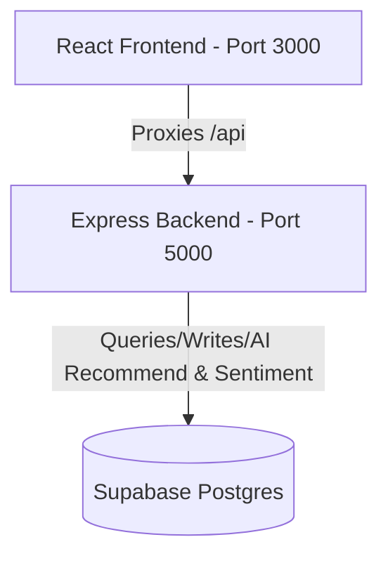

# 🚀 CampusConnect Project Workflow Guide

This guide details the complete architecture, data flow, background jobs, AI services, and verification routines of the **CampusConnect** platform to help you understand the codebase and implement changes.

---

## 🏛️ Project Architecture Overview

CampusConnect is a role-based campus consultation booking, availability broadcast, and community Q&A platform. It is split into three main layers:

1. **Frontend (Vite + React)**: Port `3000`. Handles student, teacher, and admin user interfaces.
2. **Backend API Server (Express)**: Port `5000`. A single process — `npm start` in `backend/` is enough. Directs all CRUD requests to Supabase, computes AI recommendations/sentiment inline (see below), and manages tokens and background jobs.
3. **Database (Supabase Postgres)**: Single datastore for users, bookings, ratings, community discussions, announcements, and teacher profile embeddings. There is no local SQLite database — an earlier iteration used one (`campusconnect.db`) as a dev fallback; it has been removed in favor of Supabase everywhere.

---

## 🔁 Complete Data Flows & Features

### 1. User Authentication
- Handled at [auth.cjs](file:///c:/Users/mithu/OneDrive/Desktop/sham/Campus-connect/backend/server/api/auth.cjs).
- Regulates 3 roles: `STUDENT`, `TEACHER`, and `ADMIN`.
- Passwords are encrypted with `bcrypt`. Upon validation, the server issues a JSON Web Token (JWT) cached in the frontend's `localStorage` as `cc_token`.
- Routes are protected by JWT authentication middleware.

### 2. Cabin Location Broadcast
- Teachers use the dashboard form to update their status (`Available`, `Busy`, `In Class`, `Offline`) and text cabin coordinates (e.g., "Block C - Room 304").
- This writes to the `teacher_tags` database table. The student view fetches this data in real-time to display the **Live Faculty Directory**.

### 3. Consultation Slots & Bookings
- **Slot Creation**: Teachers create specific date/time blocks in the `slots` table.
- **Student Booking**: Students select a teacher slot or make an instant booking request, creating a row in the `bookings` table with a status of `PENDING`.
- **Response**: The teacher accepts (`ACCEPTED`) or declines (`DECLINED`) the request from their Student Queue.
- **Hot Reload**: The React frontend uses Supabase Realtime/Express polling to reload dashboard lists immediately when values change in the DB.

### 4. QR Code Cabin Check-in
- Teachers check in at their physical cabins by scanning a QR code containing a secure location token.
- The backend verifies the token nonce at [qr.cjs](file:///c:/Users/mithu/OneDrive/Desktop/sham/Campus-connect/backend/server/api/qr.cjs), verifies location, and updates the teacher's cabin tags automatically.

---

## 🧠 AI Recommendation & NLP Engine

Runs inline in the main backend at [ai.cjs](file:///c:/Users/mithu/OneDrive/Desktop/sham/Campus-connect/backend/server/api/ai.cjs) — no separate service or port.

### 1. Vector Search Recommendations
- The system vectorizes text descriptions (e.g. *"I need help with Dijkstra's algorithm"*) using a 21-dimensional vocabulary bag-of-words array:
  `['algorithms', 'data structures', 'databases', 'operating systems', 'networks', 'electronics', ...]`
- Teacher profile vectors (name + department + subjects + bio) are computed live from Supabase on every request via [vectorize.cjs](file:///c:/Users/mithu/OneDrive/Desktop/sham/Campus-connect/backend/server/utils/vectorize.cjs) — no precomputed table needs to be populated first, so recommendations always reflect current teacher data.
- Normalizes vectors to unit length and measures the **Cosine Similarity** score against those live profile vectors.
- Ranks the teachers and returns matches (real Supabase teacher ids) with a specific reason string based on matching keywords.
- *Optional:* `npm run ingest` (in `backend/`) populates the `teachers_embeddings` table for future use (e.g. swapping in a real embedding model) — it isn't required for `/api/ai/recommend` to work.

### 2. Feedback Sentiment Analysis
- Analyzes review text at `/api/ai/sentiment`. Detects words like `good` or `great` to return a `positive` classification (score `0.9`), defaulting to `neutral` (score `0.5`).

---

## ⚙️ Background Workers

The Express API starts two background workers on start-up:

1. **Reputation Worker** ([reputation_worker.cjs](file:///c:/Users/mithu/OneDrive/Desktop/sham/Campus-connect/backend/server/jobs/reputation_worker.cjs)):
   - Periodically checks bookings that have passed their slot end time by a 15-minute grace period.
   - If they are still `PENDING` or `ACCEPTED`, they are automatically updated to `NO_SHOW`, and the student's `no_shows` tally increases.
   - Recalculates reputation scores: Starts at `100`, subtracts `10` per no-show, adds `1` for ratings $\ge 4$ stars, and subtracts `1` for ratings $\le 2$ stars (capped between $0$ and $200$).
2. **AI Queue Worker** ([ai_queue.cjs](file:///c:/Users/mithu/OneDrive/Desktop/sham/Campus-connect/backend/server/jobs/ai_queue.cjs)):
   - Processes background AI jobs in the `ai_jobs` table (updating status from `pending` to `done`).

---

## 🧪 QA Automation Testing

CampusConnect has an automated test suite containing 1,200 test cases:
- Runs via [automation/run_all_tests.py](file:///c:/Users/mithu/OneDrive/Desktop/sham/Campus-connect/automation/run_all_tests.py) (uses Python).
- Triggers 4 test categories (300 cases each):
  1. **Selenium Cases**: Web interface verification.
  2. **Appium Cases**: Mobile emulation checking.
  3. **Vulnerability Cases**: Security checks.
  4. **Load Performance Cases**: Concurrent request loads.
- Reports are saved in `Test Results/HTML/` (HTML dashboards) and `Test Results/Excel/` (detailed logs).
